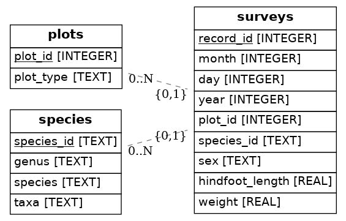

---
jupytext:
  text_representation:
    extension: .md
    format_name: myst
kernelspec:
  display_name: Python 3
  language: python
  name: python3
---

## Entity-Relationship Diagrams

In this lesson, we will briefly discuss plotting entity-relationship (ER) diagrams using a tool built for Python called ERAlchemy.  

An entity relationship diagram shows the relationships of entity sets stored in a database. Primary and foreign keys are linked using arrows. If your database does not have the keys specified, the tables will print without arrows linking the entities.  

### Alter our database

First, let's specify our keys using the mammals database from the previous lessons.

To do this, we will use _sqlite3_ in the command line and alter our database using SQL queries. Ensure you are in the same working directory as your database, and run the following command:  

> sqlite3 mammals.sqlite  

Now, we can enter SQL queries directly into the command line to alter our database.  

We can view our current tables with the command:  
```sql
.tables
```  

If you forget the schema of a table, you can check it by using:  
```sql
.schema tablename  
```

This command will output not only the column names, but also their datatypes. Use the schema command on each table, and write down the column names and datatypes for later use.  

Currently, our database is populated with the correct information, but we do not have the primary and foreign keys specified. Unfortunately, we cannot alter the table schemas keys, so we will have to create a new table and insert the original data into it.  

We'll start by renaming each table to "old\_tablename".  
```sql
ALTER TABLE surveys
RENAME TO old_surveys;
```  
After repeating this for plots and species, we must create a new table, but with the correct primary and foreign keys specified.  

Using the schemas from earlier, we can create the new tables using the old column names and datatypes.  

In order to specify the primary key, we can simply add primary key after the data type. For the foreign key, we reference the table the key belongs to after the columns are specified.  

```sql
CREATE TABLE surveys(
record_id integer primary key,
month integer,
day integer,
year integer,
plot_id integer,
species_id integer,
sex text,
hindfoot_length real,
weight real,
foreign key(plot_id) references plots(plot_id),,
foreign key(species_id) references species(species_id)
);
```  

Above, we set the primary key of _surveys_ to record\_id, and we specified the foreign key plot\_id references the plots table, and the foreign key species\_id references the species table.  

Now that our new tables are created, we can insert the data from our old tables by using an _INSERT INTO SELECT_ statement.  

**NOTE**: Make sure in any foreign key references, the table you are referencing still exists! If you reference the plots table, and then later rename and delete it, the reference will be to a nonexistent entity.  

```sql
INSERT INTO surveys
SELECT record_id, month, day, year, plot_id, species_id, sex, hindfoot_length, weight
FROM old_surveys;
```  

We can repeat this step (with the correct column names) for each other table.  

And that's it! We can delete the old tables:  
```sql
DROP TABLE surveys;
```  

### Render the ER Diagram

Now that we are done with the hard part, we can render a PNG file containing our ER diagram with one line of code.   

```python
import sqlite3
from eralchemy import render_er

## Draw from SQLalchemy base
#renderer(Base, 'erd_from_sqlalchemy.png')
render_er("sqlite:///../data/mammals.sqlite", 'erd_from_sqlite.png')
```  


